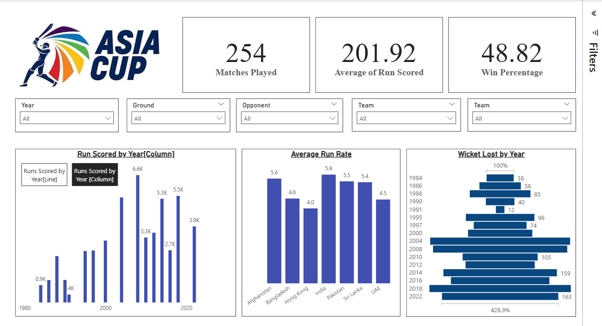
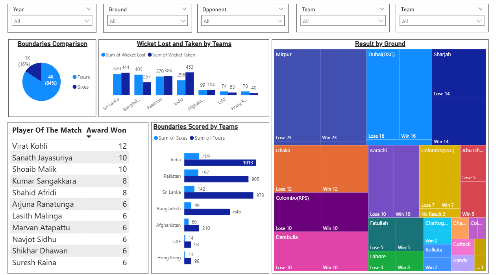

# Asia Cup Power BI Report

This Power BI report provides an interactive analysis of the **Asia Cup Cricket Tournament**.  
The dashboard is designed with **synced slicers** across both pages, making it easier for users to filter and explore the data seamlessly.

---

## Features

- **Synced Slicers**: All slicers on both pages are synced, ensuring a consistent user experience.
- **Runs Scored by Year**: Users can toggle between **Line Chart** and **Bar Chart** views.
- **Interactive Visuals**: Dynamic filtering and cross-highlighting across visuals.
---

## Report Pages & Visuals

### **Page 1 – Overview Dashboard**

- **Runs Scored by Year (Line/Bar)**: Shows how total runs vary by year with two viewing options.
- **Top Run Scorers**: Bar chart displaying top-performing batsmen.
- **Top Wicket Takers**: Visual highlighting bowlers with the most wickets.
- **Win Distribution**: Donut/Pie chart showing wins by country.

---

### **Page 2 – Detailed Insights**

- **Match-wise Runs Comparison**: Stacked column chart comparing team performances.
- **Player of the Match Awards**: Count of awards by players.
- **Country Performance Trend**: Line chart showing how each country has performed across tournaments.
- **KPIs**: Quick stats on total runs, wickets, and matches played.

---

## 🚀 How to Use
1. Open the `.pbix` file in **Power BI Desktop**.
2. Explore slicers (filters) – they are synced across both pages.
3. Switch between **Line** or **Bar** chart for "Runs Scored by Year".
4. Interact with visuals to drill down into country and player-level insights.

---

## Tools Used
- **Power BI Desktop**
- **Cricket Dataset (Asia Cup Historical Data)**

---

## Future Improvements
- Adding a **Prediction Model** for upcoming Asia Cup matches.
- More granular **player-wise drill-through reports**.
- Integration with a **live cricket API** for real-time updates.
---
